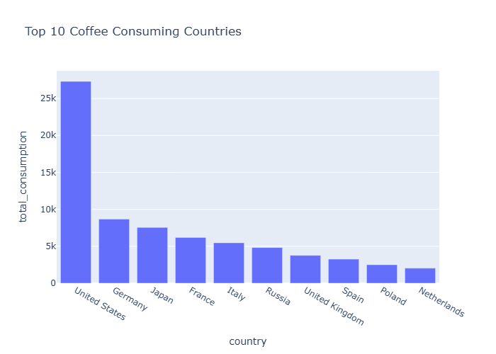

#  Coffee Consumption Analysis

This project analyzes global coffee consumption data and visualizes the top coffee-consuming countries.  
The goal is to practice **data cleaning, visualization, and insights** with Python.

---
## Project Layout
```bash
│
├── data/
│   └── raw/
│       └── coffee_consumption.csv   # Raw dataset
│
├── notebooks/
│   └── analysis.ipynb               # Jupyter notebook with analysis & visualizations
│
├── src/
│   ├── __init__.py
│   ├── data_processing.py           # Functions to clean and preprocess data
│   └── visualizations.py            # Functions to create visualizations
│
├── visualizations/
│   └── top_consumers.png            # Example saved chart
│
├── requirements.txt                 # Python dependencies
├── README.md                        # Project description & instructions
└── .gitignore                       # Files/folders to ignore in Git
```


---

##  Features

- Data cleaning with Pandas
- Interactive visualizations with Plotly
- Insights on top coffee-consuming countries
```


```
##  Example Visualization


```


```
##  Installation
```bash
Clone this repo and install dependencies:
```bash
git clone https://github.com/dewwnut/coffee-consumption-project.git
cd coffee-consumption-project
pip install -r requirements.txt
```

Author

Nada Badran
